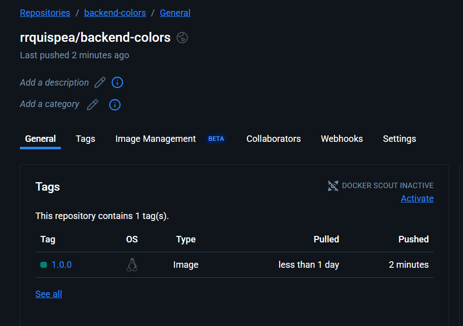

# Despliegue de backend - java springboot en kubernetes

## Prerrequisito

 * OpenJDK 17
 * Apache Maven 3.8.8

1. Creamos el proyecto maven con el siguiente comando:
    ```
        mvn archetype:generate  "-DarchetypeArtifactId=maven-archetype-quickstart"
    ```
    - El creador de Maven le hará una serie de preguntas. Elija las opciones siguientes:
   - Group ID: ```pe.com.backend```
   - Artifact ID: ```demo```
   - Version: _press: ```1.0```
   - Package ID: _press ```pe.com.backend.demo```
   - ```Y```
        * Esto creará una carpeta con un archivo POM y una estructura de carpetas Java.

2. En JDE, seleccione **Archivo > Abrir** y navegue hasta el archivo POM.xml creado en el paso anterior. Una vez seleccionado, presione el botón **Abrir como proyecto** en la siguiente ventana emergente.
3. Elimine el archivo **App.Test** ubicado en: _src > test > java > pe > com > backend ó toda la carpeta test de `src/main`
4. Abra el archivo POM seleccionándolo en el panel de jerarquía izquierdo.
5. Borramos todas las dependencias. El pom.xml debería verse así: 
    ```xml
        <project xmlns="http://maven.apache.org/POM/4.0.0" xmlns:xsi="http://www.w3.org/2001/XMLSchema-instance"
        xsi:schemaLocation="http://maven.apache.org/POM/4.0.0 http://maven.apache.org/maven-v4_0_0.xsd">
        <modelVersion>4.0.0</modelVersion>
        <groupId>org.alfresco</groupId>
        <artifactId>demo-aps</artifactId>
        <packaging>jar</packaging>
        <version>1.0-SNAPSHOT</version>
        <name>demo-aps</name>
        <url>http://maven.apache.org</url>
        <dependencies>
        </dependencies>
        </project>
    ```

6. Especifique las propiedades,el parent a springboot, dependencias y la construcción del proyecto.

```xml
    <properties>
		<maven.compiler.source>17</maven.compiler.source>
		<maven.compiler.target>17</maven.compiler.target>
	</properties>
  <parent>
    <groupId>org.springframework.boot</groupId>
    <artifactId>spring-boot-starter-parent</artifactId>
    <version>3.5.6</version>
    <relativePath/> <!-- lookup parent from repository -->
  </parent>
  <dependencies>
    <!-- Web MVC / REST -->
    <dependency>
      <groupId>org.springframework.boot</groupId>
      <artifactId>spring-boot-starter-web</artifactId>
    </dependency>
  </dependencies>

   <build>
    <plugins>
      <plugin>
        <groupId>org.springframework.boot</groupId>
        <artifactId>spring-boot-maven-plugin</artifactId>
      </plugin>
    </plugins>
  </build>
```

7. Cambiamos la clase principal a un aplicación en springboot.

```java
package pe.com.backend.demo;

import org.springframework.boot.SpringApplication;
import org.springframework.boot.autoconfigure.SpringBootApplication;

@SpringBootApplication
public class DemoApplication {
  public static void main(String[] args) {
    SpringApplication.run(DemoApplication.class, args);
  }
}
```

8. Creamos el application.properties en `src/main/resources`

```properties
spring.application.name=demo
```

9. Probamos ejecutando el siguiente comando para compilar con las dependencias

```bash
mvn clean package
```


## Creación del backend

Vamos a crear un proyecto SpringBoot CRUD ReST con postgresql.

- Al iniciar: si NO existe la tabla color, la crea y con valores por defecto, Si la tabla ya existe: no inserta nada.
- Expone API REST /api/colors/...
- Incluye Swagger UI con springdoc.

1. Agregamos las siguientes dependencias

```xml
    <!-- JPA -->
    <dependency>
      <groupId>org.springframework.boot</groupId>
      <artifactId>spring-boot-starter-data-jpa</artifactId>
    </dependency>
    <!-- PostgreSQL driver -->
    <dependency>
      <groupId>org.postgresql</groupId>
      <artifactId>postgresql</artifactId>
      <scope>runtime</scope>
    </dependency>

    <!-- Swagger / OpenAPI -->
    <dependency>
      <groupId>org.springdoc</groupId>
      <artifactId>springdoc-openapi-starter-webmvc-ui</artifactId>
      <version>2.6.0</version>
    </dependency>
    <!-- Actuator -->
    <dependency>
      <groupId>org.springframework.boot</groupId>
      <artifactId>spring-boot-starter-actuator</artifactId>
    </dependency>
```

2. Definimos las propiedades para postgresql en el properties

```properties
# ya sabemos que es en kubernetes entonces colocamos el servicio interno (dev-psql-hl-svc).
spring.datasource.url=jdbc:postgresql://k8scp:30101/db
spring.datasource.username=user
spring.datasource.password=pass

# JPA: no generar/alterar esquema automáticamente (lo hacemos nosotros)
spring.jpa.hibernate.ddl-auto=none
spring.jpa.show-sql=true

# Swagger UI en /swagger-ui.html
springdoc.swagger-ui.path=/swagger-ui.html

# Actuator para Kubernetes
management.endpoints.web.exposure.include=health,info
management.health.probes.enabled=true
```
3. Se crean las siguientes clases:

  ```bash
  backend\demo\src\main\java\pe\com\backend\demo\config\SchemaInitializer.java
  backend\demo\src\main\java\pe\com\backend\demo\controllers\ColorController.java
  backend\demo\src\main\java\pe\com\backend\demo\entities\Color.java
  backend\demo\src\main\java\pe\com\backend\demo\repositories\ColorRepository.java
  ```

4. En VSCode podemos instalar la extensión  `REST Client Huachao Mao` y utilizar [colors-api-http](./colors-api.http) 

5. Desde el navegador podemos ver e interactuar con el swagger directamente `http://localhost:8080/swagger-ui/index.html` 

## Despliegue en kubernetes

Para desplegarlo en kubernetes es necesario tener acceso a al repositorio público o privado de imagenes de docker.

1. Creación de la imagen; se puede realizar por dockerfile o con maven.
    El comando en powershell es el siguiente
    ```powershell
    mvn spring-boot:build-image "-Dspring-boot.build-image.imageName=rrquispea/backend-colors:1.0.0"
    ```

2. Realizamos un push de la imagen creada al repositorio creado.

    ```powershell
    docker push rrquispea/backend-colors:1.0.0
    ```

3. Se creará un repositorio público en dockerhub.

  

  > Nota: Se puede crear un repositorio privado pero debe ser creado previamente o utilizar GHCR.


