# Despliegue de backend - java springboot en kubernetes

## Prerrequisito

 * OpenJDK 17
 * Apache Maven 3.8.8
 * Ingress Controller nginx
    ```powershell
      kubectl apply -f https://raw.githubusercontent.com/kubernetes/ingress-nginx/controller-v1.10.1/deploy/static/provider/baremetal/deploy.yaml
    ```
    se crea un service NodePort con puertos expuestos para http y https.

1. Creamos el proyecto maven con el siguiente comando:
    ```
        mvn archetype:generate  "-DarchetypeArtifactId=maven-archetype-quickstart"
    ```
    - El creador de Maven le hará una serie de preguntas. Elija las opciones siguientes:
   - Group ID: ```pe.com.backend```
   - Artifact ID: ```demo```
   - Version: _press: ```1.0```
   - Package ID: _press ```pe.com.backend.demo```
   - ```Y```
        * Esto creará una carpeta con un archivo POM y una estructura de carpetas Java.

2. En JDE, seleccione **Archivo > Abrir** y navegue hasta el archivo POM.xml creado en el paso anterior. Una vez seleccionado, presione el botón **Abrir como proyecto** en la siguiente ventana emergente.
3. Elimine el archivo **App.Test** ubicado en: _src > test > java > pe > com > backend ó toda la carpeta test de `src/main`
4. Abra el archivo POM seleccionándolo en el panel de jerarquía izquierdo.
5. Borramos todas las dependencias. El pom.xml debería verse así: 
    ```xml
        <project xmlns="http://maven.apache.org/POM/4.0.0" xmlns:xsi="http://www.w3.org/2001/XMLSchema-instance"
        xsi:schemaLocation="http://maven.apache.org/POM/4.0.0 http://maven.apache.org/maven-v4_0_0.xsd">
        <modelVersion>4.0.0</modelVersion>
        <groupId>org.alfresco</groupId>
        <artifactId>demo-aps</artifactId>
        <packaging>jar</packaging>
        <version>1.0-SNAPSHOT</version>
        <name>demo-aps</name>
        <url>http://maven.apache.org</url>
        <dependencies>
        </dependencies>
        </project>
    ```

6. Especifique las propiedades,el parent a springboot, dependencias y la construcción del proyecto.

```xml
    <properties>
		<maven.compiler.source>17</maven.compiler.source>
		<maven.compiler.target>17</maven.compiler.target>
	</properties>
  <parent>
    <groupId>org.springframework.boot</groupId>
    <artifactId>spring-boot-starter-parent</artifactId>
    <version>3.5.6</version>
    <relativePath/> <!-- lookup parent from repository -->
  </parent>
  <dependencies>
    <!-- Web MVC / REST -->
    <dependency>
      <groupId>org.springframework.boot</groupId>
      <artifactId>spring-boot-starter-web</artifactId>
    </dependency>
  </dependencies>

   <build>
    <plugins>
      <plugin>
        <groupId>org.springframework.boot</groupId>
        <artifactId>spring-boot-maven-plugin</artifactId>
      </plugin>
    </plugins>
  </build>
```

7. Cambiamos la clase principal a un aplicación en springboot.

```java
package pe.com.backend.demo;

import org.springframework.boot.SpringApplication;
import org.springframework.boot.autoconfigure.SpringBootApplication;

@SpringBootApplication
public class DemoApplication {
  public static void main(String[] args) {
    SpringApplication.run(DemoApplication.class, args);
  }
}
```

8. Creamos el application.properties en `src/main/resources`

```properties
spring.application.name=demo
```

9. Probamos ejecutando el siguiente comando para compilar con las dependencias

```bash
mvn clean package
```


## Creación del backend

Vamos a crear un proyecto SpringBoot CRUD ReST con postgresql.

- Al iniciar: si NO existe la tabla color, la crea y con valores por defecto, Si la tabla ya existe: no inserta nada.
- Expone API REST /api/colors/...
- Incluye Swagger UI con springdoc.

1. Agregamos las siguientes dependencias

```xml
    <!-- JPA -->
    <dependency>
      <groupId>org.springframework.boot</groupId>
      <artifactId>spring-boot-starter-data-jpa</artifactId>
    </dependency>
    <!-- PostgreSQL driver -->
    <dependency>
      <groupId>org.postgresql</groupId>
      <artifactId>postgresql</artifactId>
      <scope>runtime</scope>
    </dependency>

    <!-- Swagger / OpenAPI -->
    <dependency>
      <groupId>org.springdoc</groupId>
      <artifactId>springdoc-openapi-starter-webmvc-ui</artifactId>
      <version>2.6.0</version>
    </dependency>
    <!-- Actuator -->
    <dependency>
      <groupId>org.springframework.boot</groupId>
      <artifactId>spring-boot-starter-actuator</artifactId>
    </dependency>
```

2. Definimos las propiedades para postgresql en el properties

```properties
# ya sabemos que es en kubernetes entonces colocamos el servicio interno (dev-psql-hl-svc).
spring.datasource.url=jdbc:postgresql://k8scp:30101/db
spring.datasource.username=user
spring.datasource.password=pass

# JPA: no generar/alterar esquema automáticamente (lo hacemos nosotros)
spring.jpa.hibernate.ddl-auto=none
spring.jpa.show-sql=true

# Swagger UI en /swagger-ui.html
springdoc.swagger-ui.path=/swagger-ui.html

# Actuator para Kubernetes
management.endpoints.web.exposure.include=health,info
management.health.probes.enabled=true
```
3. Se crean las siguientes clases:

  ```bash
  backend\demo\src\main\java\pe\com\backend\demo\config\SchemaInitializer.java
  backend\demo\src\main\java\pe\com\backend\demo\controllers\ColorController.java
  backend\demo\src\main\java\pe\com\backend\demo\entities\Color.java
  backend\demo\src\main\java\pe\com\backend\demo\repositories\ColorRepository.java
  ```

4. En VSCode podemos instalar la extensión  `REST Client Huachao Mao` y utilizar [colors-api-http](./colors-api.http) 

5. Desde el navegador podemos ver e interactuar con el swagger directamente `http://localhost:8080/swagger-ui/index.html` 

## Despliegue en kubernetes

Para desplegarlo en kubernetes es necesario tener acceso a al repositorio público o privado de imagenes de docker.

1. Creación de la imagen; se puede realizar por dockerfile o con maven.
    El comando en powershell es el siguiente
    ```powershell
    mvn spring-boot:build-image "-Dspring-boot.build-image.imageName=rrquispea/backend-colors:1.0.0"
    ```

2. Realizamos un push de la imagen creada al repositorio creado.

    ```powershell
    docker push rrquispea/backend-colors:1.0.0
    ```

3. Se creará un repositorio público en dockerhub.

  

  > Nota: Se puede crear un repositorio privado pero debe ser creado previamente o utilizar GHCR.


4. Creación del namespace

```yaml
apiVersion: v1
kind: Namespace
metadata:
  name: ns-backend
```

4. Creación de configuración pública (ConfigMap)

```yaml
apiVersion: v1
kind: ConfigMap
metadata:
  name: backend-cm
  namespace: ns-backend
data:
  # DEFAULT (se aplica siempre)
  application.properties: |
    spring.jpa.hibernate.ddl-auto=none
    spring.jpa.show-sql=true
    spring.datasource.url=jdbc:postgresql://dev-psql-hl-svc.ns-postgresql.svc.cluster.local:5432/db
    spring.datasource.username=user
    springdoc.swagger-ui.path=/swagger-ui.html
    management.endpoints.web.exposure.include=health,info
    management.health.probes.enabled=true

```

Este configmap se montará en `/config` para que spring lo pueda leer.

5. Creación de configuración privada (Secret)

```yaml
apiVersion: v1
kind: Secret
metadata:
  name: backend-secret
  namespace: ns-backend
type: Opaque
data:
  # echo -n 'pass' | base64
  SPRING_DATASOURCE_PASSWORD: cGFzcw==
```

La contraseña se pasará como variable de entorno.

6. Creación del deployment

```yaml
apiVersion: apps/v1
kind: Deployment
metadata:
  name: backend
  namespace: ns-backend
  labels:
    app: demo-backend
    env: dev
spec:
  replicas: 2
  strategy:
    type: RollingUpdate
    rollingUpdate:
      maxUnavailable: 0
      maxSurge: 1
  selector:
    matchLabels:
       app: demo-backend
       env: dev
  template:
    metadata:
      labels:
       app: demo-backend 
       env: dev
    spec:
      containers:
        - name: demo-backend
          image: rrquispea/backend-colors:1.0.0
          imagePullPolicy: IfNotPresent
          ports:
            - containerPort: 8080
          env:
            # Spring busca config en /config
            - name: SPRING_CONFIG_ADDITIONAL_LOCATION
              value: "file:/config/"
            # Password del Secret (mapeada a spring.datasource.password)
            - name: SPRING_DATASOURCE_PASSWORD
              valueFrom:
                secretKeyRef:
                  name: backend-secret
                  key: SPRING_DATASOURCE_PASSWORD
          volumeMounts:
            - name: app-config
              mountPath: /config               # Aquí montamos los application.properties
              readOnly: true
          # Probes (requieren actuator)
          readinessProbe:
            httpGet:
              path: /actuator/health/readiness
              port: 8080
            initialDelaySeconds: 10
            periodSeconds: 5
            timeoutSeconds: 2
            failureThreshold: 6
          livenessProbe:
            httpGet:
              path: /actuator/health/liveness
              port: 8080
            initialDelaySeconds: 20
            periodSeconds: 10
            timeoutSeconds: 2
            failureThreshold: 3
          resources:
            requests:
              cpu: "100m"
              memory: "512Mi"
            limits:
              cpu: "500m"
              memory: "1Gi"
      volumes:
        - name: app-config
          configMap:
            name: backend-cm
            # Mapea el archivo del ConfigMap al directorio /config
            items:
              - key: application.properties
                path: application.properties
```

7. Creación del servicio

```yaml
apiVersion: v1
kind: Service
metadata:
  name: backend-svc
  namespace: ns-backend
  labels:
    env: dev
spec:
  type: ClusterIP
  selector:
    app: demo-backend
    env: dev
  ports:
    - name: http
      port: 80          # puerto del Service
      targetPort: 8080  # puerto del container en tu Deployment

```

8. Creación del ingress

```yaml
apiVersion: networking.k8s.io/v1
kind: Ingress
metadata:
  name: backend-ingress
  namespace: ns-backend
  annotations:
    # (Opcional) Si necesitas CORS desde un frontend externo:
    # nginx.ingress.kubernetes.io/enable-cors: "true"
    # nginx.ingress.kubernetes.io/cors-allow-origin: "http://localhost:5173,http://tu-frontend.example"
    # nginx.ingress.kubernetes.io/cors-allow-methods: "GET, PUT, POST, DELETE, OPTIONS"
    # nginx.ingress.kubernetes.io/cors-allow-headers: "Authorization,Content-Type"
    # nginx.ingress.kubernetes.io/cors-allow-credentials: "true"
spec:
  ingressClassName: nginx
  rules:
    - host: api.k8scp
      http:
        paths:
          - path: /
            pathType: Prefix
            backend:
              service:
                name: backend-svc
                port:
                  number: 80
  # (Opcional) TLS: crea previamente el secret demo-tls con tu cert/clave
  # tls:
  #   - hosts:
  #       - api.demo.local
  #     secretName: demo-tls

```

9. Ejecutamos los siguientes comandos para crear los objetos en kubernetes:

```bash
kubectl apply -f .\01_ns.yaml                                                              
namespace/ns-backend created
kubectl apply -f .\02_cm.yaml
configmap/backend-cm created
kubectl apply -f .\03_secret.yaml
secret/backend-secret created
kubectl apply -f .\04_svc.yaml
service/backend-svc created
kubectl apply -f .\05_ingress.yaml
ingress.networking.k8s.io/backend-ingress created
kubectl apply -f .\06_deployment.yaml
deployment.apps/backend created
```

10. En VSCode podemos instalar la extensión  `REST Client Huachao Mao` y utilizar [colors-api-http-k8s](./colors-api-k8s.http) 

11. Desde el navegador podemos ver e interactuar con el swagger directamente `http://api.k8scp:32449/swagger-ui/index.html` 

> Nota: En hosts definir api.k8scp con la IP de uno de los nodos del cluster. Mis puertos habilitados para http es 32449 y https es 30198

12. Podemos visualizar el swagger y realizar peticiones

```mermaid
flowchart LR
  %% ====== estilos ======
  classDef ingress fill:#4FC3F7,stroke:#1976D2,color:#fff,stroke-width:1.5;
  classDef svc     fill:#81D4FA,stroke:#1565C0,color:#fff,stroke-width:1.5;
  classDef dep     fill:#66BB6A,stroke:#2E7D32,color:#fff,stroke-width:1.5;
  classDef sts     fill:#F48FB1,stroke:#AD1457,color:#fff,stroke-width:1.5;
  classDef cm      fill:#FFF8E1,stroke:#F4C04D,color:#333,stroke-width:1.5;
  classDef sec     fill:#FDEFF0,stroke:#E08A95,color:#333,stroke-width:1.5;
  classDef pvc     fill:#BBDEFB,stroke:#1976D2,color:#333,stroke-width:1.5;
  classDef vol     fill:#E3F2FD,stroke:#64B5F6,color:#333,stroke-width:1.5;

  Clients[[Clients]]

  subgraph NSB[Helm/Workloads — ns-backend]
    direction LR
    IN["Ingress backend-ingress<br/>host= api.k8scp  /  path= /"]:::ingress
    SVC["Service backend-svc<br/>80 → 8080"]:::svc
    DEP["Deployment demo<br/>replicas=3"]:::dep
    CM["ConfigMap demo-config<br/>mount /config<br/>application*.properties"]:::cm
    SEC["Secret demo-db<br/>SPRING_DATASOURCE_PASSWORD"]:::sec
  end

  subgraph NSPG[storage — ns-postgresql]
    direction LR
    DBSVC["Service dev-psql-hl-svc (headless)<br/>FQDN= dev-psql-hl-svc.ns-postgresql.svc.cluster.local<br/>port 5432"]:::svc
    STS["StatefulSet postgresql"]:::sts
    PVC["PersistentVolumeClaim pgdatavol"]:::pvc
    VOL["Data Volume LongHorn"]:::vol
    DBSVC --> STS --> PVC --> VOL
  end

  Clients --> IN --> SVC --> DEP
  DEP -->|JDBC 5432| DBSVC
  CM -. mount .-> DEP
  SEC -. env var .-> DEP
```

  




[⬅️ Anterior](../postgres/postgres.md) | [🏠 Volver al Inicio](../README.md)
