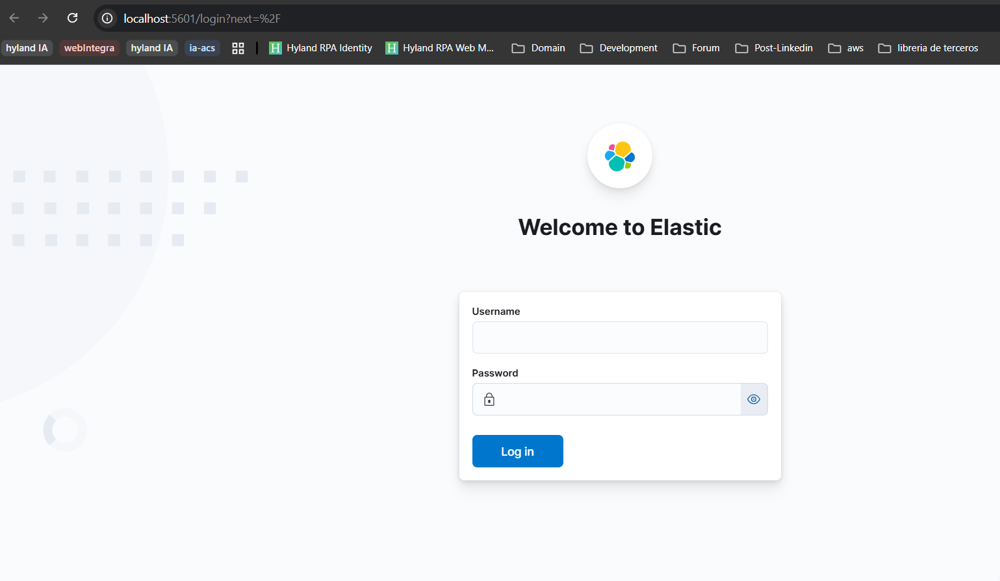
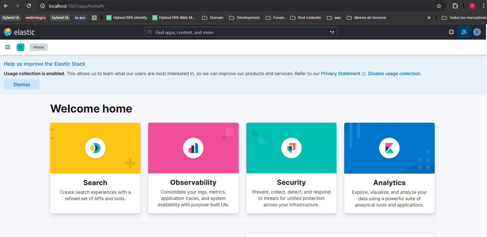
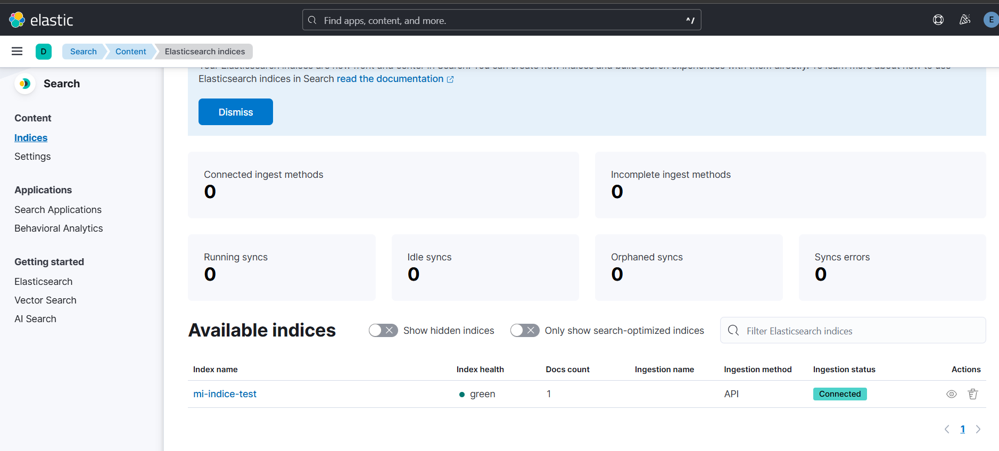

# Instalación de elasticSearch en kubernetes

## ¿Qué son los operadores?

En k8s, un operador es un controlador especializado que extiende la API del clúster para gestionar aplicaciones complejas (instalar, escalar, actualizar, hacer copias de seguridad, recuperar de fallos), usando las mismas declaraciones primitivas de k8s.

### ¿Qué es?

* Un nuevo tipo de recurso: define un CRD (CustomResourceDefinition) como, por ejemplo, `Elasticsearch`, `Kafka`, `Postgres`.
* Controlador: un proceso que observa esos recursos y ejecuta la lógica para llevar el sistema al `estado deseado` (patrón `reconciliation loop`).
* Cerebro de dominio: codifica el conocimiento operativo de un SRE humano (procedimiento, órdenes de actualización, salud, backups).

## Proceso de despliegue de Elasticsearch

### Paso 1: Instalación del operador ECK

Se instala en dos fases: CRDs primero, luego el operador

#### 1.1 Custom Resource Definitions (CRDs)

Define los nuevos "tipos" de objetos que ECK introduce en Kubernetes, estos son: Elasticsearch, Kibana, ApmServer, EnterpriseSearch, Beats, ElasticMapsServer, Agent, Logstash. Sin estos CRDs, Kubernetes no sabría qué hacer con un objeto tipo "kind: Elasticsearch"

```bash
kubectl create -f https://download.elastic.co/downloads/eck/2.10.0/crds.yaml
```
¿Qué hace internamente?
- Registra nuevos tipos de recursos en la API de Kubernetes
- Define la estructura (schema) que deben tener estos recursos
- Permite validación automática de los manifiestos
- Debe instalarse ANTES del operador

#### 1.2 El Operador ECK

Es el "cerebro" que observa los recursos Elasticsearch/Kibana y los materializa. Un operador es un patrón de Kubernetes que extiende la funcionalidad de la API

```bash
kubectl apply -f https://download.elastic.co/downloads/eck/2.10.0/operator.yaml
```

¿Qué contiene este manifiesto? (Principales componentes):
1. Namespace "elastic-system" - donde vive el operador
2. ServiceAccount - para que el operador pueda leer/escribir en K8s API
3. ClusterRole - permisos que necesita (crear pods, services, secrets, etc.)
4. ClusterRoleBinding - conecta el ServiceAccount con los permisos
5. StatefulSet/Deployment - el operador en sí (un pod que corre 24/7)
6. Service - para webhooks de validación
7. ValidatingWebhookConfiguration - valida tus manifiestos antes de aplicarlos

El operador entra en un loop infinito:
- Observa cambios en recursos tipo "Elasticsearch"
- Compara el estado actual vs. el deseado
- Toma acciones para reconciliar (crear pods, configurar networking, etc.)


### Paso 2: Definición del namespace

```yaml
apiVersion: v1
kind: Namespace
metadata:
  name: elasticsearch
  labels:
    name: elasticsearch
```

- Aísla los recursos de Elasticsearch
- Facilita gestión con kubectl (kubectl get all -n elasticsearch)
- Permite aplicar políticas de seguridad específicas
- Mejor organización en clusters multi-tenant

### Paso 3: Definición del storageClass


```yaml
apiVersion: storage.k8s.io/v1
kind: StorageClass
metadata:
  name: longhorn-elasticsearch
provisioner: driver.longhorn.io
allowVolumeExpansion: true
parameters:
  numberOfReplicas: "2"
  staleReplicaTimeout: "2880"
  fromBackup: ""
  fsType: "ext4"
```
- Crea una StorageClass específica para Elasticsearch
- numberOfReplicas: "2" - Longhorn mantiene 2 copias de los datos (HA)
- allowVolumeExpansion: true - Permite crecer los discos sin downtime
- staleReplicaTimeout: 48h - tiempo antes de marcar réplica como obsoleta
- fsType: ext4 - sistema de archivos (mejor rendimiento para ES que xfs en este caso)

#### ¿Por qué una StorageClass separada?

- Permite tuning específico para cargas de trabajo de Elasticsearch
- Facilita troubleshooting (sabes qué volúmenes son de ES)
- Puedes cambiar parámetros sin afectar otras apps

### Paso 4: Definición del clúster de elasticSearch (CRD creado)
```yaml
apiVersion: elasticsearch.k8s.elastic.co/v1
kind: Elasticsearch
metadata:
  name: elasticsearch
  namespace: elasticsearch
# RAZÓN del metadata:
# - name: será el prefijo de todos los recursos (pods, services, secrets)
# - namespace: dónde vivirá todo

spec:
  version: 8.11.0
  # RAZÓN: Versión de Elasticsearch a desplegar
  # ECK se encarga de:
  # - Descargar la imagen correcta
  # - Aplicar configuraciones específicas de esa versión
  # - Gestionar migraciones si actualizas la versión
  
  # --------------------------------------------------------------------------
  # HTTP Configuration
  # --------------------------------------------------------------------------
  http:
    service:
      spec:
        type: ClusterIP
        # RAZÓN del tipo ClusterIP:
        # - Solo accesible dentro del cluster (más seguro)
        # - Para acceso externo usarías: LoadBalancer o NodePort
        # - En local, usarás port-forward para acceder
    tls:
      selfSignedCertificate:
        disabled: true
        # RAZÓN disabled: true:
        # - Simplifica desarrollo local (no necesitas gestionar certificados)
        # - En producción deberías: disabled: false (TLS habilitado)
        # - ECK auto-genera certificados si está habilitado
  
  # --------------------------------------------------------------------------
  # NodeSets - Define grupos de nodos con roles específicos
  # --------------------------------------------------------------------------
  nodeSets:
  - name: master-data
    # RAZÓN del nombre:
    # - Identificador del grupo de nodos
    # - Los pods se llamarán: elasticsearch-es-master-data-0, -1, -2
    # - Puedes tener múltiples nodeSets con roles diferentes
    
    count: 3
    # RAZÓN count: 3:
    # - Mínimo recomendado para evitar split-brain
    # - Con 3 nodos master, el quorum es 2 (mayoría)
    # - Si un nodo cae, el cluster sigue funcionando
    
    config:
      # Configuración de Elasticsearch que irá en elasticsearch.yml
      node.roles: ["master", "data", "ingest"]
      # RAZÓN de los roles:
      # - master: Puede ser elegido como master del cluster (gestiona metadata)
      # - data: Almacena datos e índices
      # - ingest: Puede procesar pipelines de ingest (transformaciones)
      # 
      # Nodos híbridos (master+data) son buenos para:
      # - Clusters pequeños/medianos (como el tuyo)
      # - Simplifica arquitectura
      # En clusters grandes separarías: nodos master dedicados, data nodes, etc.
      
      node.store.allow_mmap: false
      # RAZÓN:
      # - Desactiva memory-mapped files
      # - Útil en entornos con restricciones de memoria
      # - Puede reducir rendimiento pero aumenta estabilidad en VMs
      
      xpack.security.enabled: true
      # RAZÓN:
      # - Habilita autenticación (usuario/password)
      # - ECK auto-genera credenciales y las guarda en un Secret
      # - Para obtener la password: 
      #   kubectl get secret elasticsearch-es-elastic-user -n elasticsearch -o=jsonpath='{.data.elastic}' | base64 --decode
      
      xpack.security.transport.ssl.enabled: true
      # RAZÓN:
      # - Encripta comunicación entre nodos del cluster
      # - Obligatorio cuando xpack.security.enabled: true
      # - ECK gestiona los certificados automáticamente
      
      xpack.security.http.ssl.enabled: false
      # RAZÓN:
      # - Desactiva HTTPS en la API REST (simplifica desarrollo local)
      # - En producción deberías usar: true
      # - Si es true, accederías con https://localhost:9200
    
    # ------------------------------------------------------------------------
    # PodTemplate - Personaliza los pods de Elasticsearch
    # ------------------------------------------------------------------------
    podTemplate:
      metadata:
        labels:
          app: elasticsearch
          # RAZÓN:
          # - Facilita selección con kubectl (kubectl get pods -l app=elasticsearch)
          # - Útil para NetworkPolicies, Services, etc.
      
      spec:
        affinity:
          nodeAffinity:
            requiredDuringSchedulingIgnoredDuringExecution:
              nodeSelectorTerms:
              - matchExpressions:
                - key: kubernetes.io/hostname
                  operator: In
                  values:
                  - worker01
        # ----------------------------------------------------------------------
        # InitContainers - Se ejecutan ANTES del contenedor principal
        # ----------------------------------------------------------------------
        initContainers:
        - name: sysctl
          # RAZÓN de este initContainer:
          # - Elasticsearch requiere vm.max_map_count >= 262144
          # - Es un parámetro del kernel del host
          # - Solo se puede cambiar con privilegios
          securityContext:
            privileged: true
            # RAZÓN privileged: true:
            # - Permite modificar parámetros del kernel
            # - Solo se usa en initContainer (no en el contenedor principal)
            # - Necesario para sysctl
          command: ['sh', '-c', 'sysctl -w vm.max_map_count=262144']
          # ¿Qué hace?
          # - sysctl modifica parámetros del kernel
          # - vm.max_map_count: número máximo de áreas de memoria mapeadas
          # - Elasticsearch usa mmap para índices (mejor rendimiento)
          # - Sin esto, Elasticsearch no arranca
        
        - name: install-plugins
          # RAZÓN (OPCIONAL):
          # - Instala plugins de Elasticsearch antes de iniciar
          # - Ejemplo: analysis-icu para soporte Unicode avanzado
          # - Se ejecuta una vez al crear el pod
          command:
          - sh
          - -c
          - |
            bin/elasticsearch-plugin install --batch analysis-icu
          # Plugins útiles:
          # - analysis-icu: Análisis de texto Unicode
          # - repository-s3: Snapshots en AWS S3
          # - discovery-ec2: Discovery en AWS
        
        # ----------------------------------------------------------------------
        # Containers - El contenedor principal de Elasticsearch
        # ----------------------------------------------------------------------
        containers:
        - name: elasticsearch
          # RAZÓN del nombre:
          # - ECK espera este nombre específico
          # - No lo cambies o ECK no funcionará correctamente
          
          env:
          - name: ES_JAVA_OPTS
            value: "-Xms2g -Xmx2g"
            # RAZÓN:
            # - Xms: Heap inicial de Java
            # - Xmx: Heap máximo de Java
            # - Deben ser IGUALES (evita resize de heap = mejor rendimiento)
            # - Regla: 50% de la RAM del pod, máximo 31GB
            # - Para 4GB de RAM del pod → 2GB de heap
            # 
            # ⚠️ IMPORTANTE:
            # - Nunca más de 31GB (compressed oops de JVM)
            # - El resto de RAM es para: filesystem cache, Lucene, OS
          
          - name: READINESS_PROBE_TIMEOUT
            value: "10"
            # RAZÓN:
            # - Timeout para el readiness probe
            # - Si el cluster es lento al iniciar, aumenta esto
            # - Evita que K8s mate pods prematuramente
          
          resources:
            requests:
              memory: 2Gi
              cpu: 1
              # RAZÓN de requests:
              # - Garantiza estos recursos mínimos
              # - K8s solo programa el pod si hay recursos disponibles
              # - Afecta scheduling (dónde se coloca el pod)
            
            limits:
              memory: 3Gi
              cpu: 2
              # RAZÓN de limits:
              # - memory: DEBE ser igual a request para ES (evita OOM kills)
              # - cpu: Puede ser mayor (permite burst)
              # - Si se excede memory, K8s mata el pod (OOMKilled)
          
          # --------------------------------------------------------------------
          # Probes - Salud del contenedor
          # --------------------------------------------------------------------
          # RAZÓN de las probes:
          # - livenessProbe: ¿El proceso está vivo? Si falla → restart
          # - readinessProbe: ¿Está listo para tráfico? Si falla → quita de Service
          # - ECK configura estas automáticamente, pero podemos ajustarlas
    
    # ------------------------------------------------------------------------
    # VolumeClaimTemplates - Almacenamiento persistente
    # ------------------------------------------------------------------------
    volumeClaimTemplates:
    - metadata:
        name: elasticsearch-data
        # RAZÓN:
        # - Nombre del volumen dentro del pod
        # - Se monta en /usr/share/elasticsearch/data (path por defecto)
      
      spec:
        accessModes:
        - ReadWriteOnce
        # RAZÓN ReadWriteOnce:
        # - Solo un nodo puede montar el volumen a la vez
        # - Suficiente para StatefulSets (cada pod su volumen)
        # - Alternativas:
        #   - ReadWriteMany: múltiples nodos (no lo necesitas con StatefulSets)
        #   - ReadOnlyMany: solo lectura desde múltiples nodos
        
        resources:
          requests:
            storage: 30Gi
        # RAZÓN 30Gi:
        # - Depende de cuántos datos esperas indexar
        # - Elasticsearch recomienda 80% de uso máximo
        # - Puedes expandir después si allowVolumeExpansion: true
        # - Para producción: calcula basado en:
        #   - Volumen diario de datos
        #   - Retención (cuántos días de datos)
        #   - Número de réplicas de índices
        
        storageClassName: longhorn-elasticsearch
        # RAZÓN:
        # - Usa la StorageClass que creamos antes
        # - Longhorn provisionará el volumen automáticamente
        # - Cada pod (0,1,2) tendrá su propio PVC/PV

```
### Paso 5: Definición de kibana (Opcional)

```yaml
apiVersion: kibana.k8s.elastic.co/v1
kind: Kibana
metadata:
  name: kibana
  namespace: elasticsearch
# RAZÓN de Kibana:
# - Interface gráfica para Elasticsearch
# - Visualización de datos
# - Dev Tools para queries
# - Gestión de índices, snapshots, etc.
# - Monitoreo del cluster

spec:
  version: 8.11.0
  # RAZÓN: Debe coincidir con la versión de Elasticsearch
  
  count: 1
  # RAZÓN count: 1:
  # - Kibana es stateless (no almacena datos)
  # - 1 instancia es suficiente para desarrollo
  # - En producción podrías usar 2+ para HA
  
  elasticsearchRef:
    name: elasticsearch
    # RAZÓN:
    # - Conecta Kibana con el Elasticsearch del mismo namespace
    # - ECK auto-configura:
    #   - URL de conexión
    #   - Credenciales (usa el usuario elastic)
    #   - Certificados TLS si están habilitados
    # - Si estuviera en otro namespace: 
    #   name: elasticsearch
    #   namespace: otro-namespace
  
  http:
    service:
      spec:
        type: ClusterIP
        # RAZÓN ClusterIP:
        # - Acceso interno al cluster
        # - Usarás port-forward: kubectl port-forward svc/kibana-kb-http 5601 -n elasticsearch
        # - Para acceso externo: LoadBalancer o Ingress
    
    tls:
      selfSignedCertificate:
        disabled: true
        # RAZÓN disabled: true:
        # - Simplifica desarrollo (acceso HTTP simple)
        # - En producción: false (HTTPS habilitado)
  
  podTemplate:
    spec:
      containers:
      - name: kibana
        resources:
          requests:
            memory: 1Gi
            cpu: 500m
            # RAZÓN:
            # - Kibana necesita menos recursos que Elasticsearch
            # - 1GB RAM suele ser suficiente para dev
            # - CPU: 0.5 cores request, puede usar más si está disponible
          limits:
            memory: 2Gi
            cpu: 2
            # RAZÓN:
            # - Permite burst cuando hay dashboards complejos
            # - 2GB límite de memoria para evitar OOM
        
        env:
        - name: NODE_OPTIONS
          value: "--max-old-space-size=1024"
          # RAZÓN:
          # - Kibana corre en Node.js
          # - Limita heap de Node.js a 1GB
          # - Previene uso excesivo de memoria
          # - Debe ser menor que el límite de memoria del container

```


### Paso 6: Definición de politicas de red (Opcional)

- Limita qué pods pueden comunicarse con Elasticsearch
- Solo Kibana y apps autorizadas
- Defensa en profundidad

```yaml
apiVersion: networking.k8s.io/v1
kind: NetworkPolicy
metadata:
  name: elasticsearch-netpol
  namespace: elasticsearch
spec:
  podSelector:
    matchLabels:
      elasticsearch.k8s.elastic.co/cluster-name: elasticsearch
  policyTypes:
  - Ingress
  ingress:
  - from:
    - podSelector:
        matchLabels:
          kibana.k8s.elastic.co/name: kibana
    # Permite tráfico desde Kibana
  - from:
    - namespaceSelector:
        matchLabels:
          name: mi-app
    # Permite tráfico desde namespace de tu aplicación
  - ports:
    - protocol: TCP
      port: 9300
    from:
    - podSelector:
        matchLabels:
          elasticsearch.k8s.elastic.co/cluster-name: elasticsearch
    # Permite comunicación entre nodos de ES (transport port)
```


## Despliegue

```bash
kubectl apply -f 01_ns.yaml
kubectl apply -f 02_sc-es.yaml
kubectl apply -f 03_crd-es.yaml
kubectl apply -f 04_crd-kibana.yaml
kubectl apply -f 05_np.yaml # (opcional)
```
## Acceso a ElasticSearch

ECK crea automáticamente un usuario `elastic` con una contraseña aleatoria guardada en un secret:

```bash
kubectl get secret elasticsearch-es-elastic-user -n elasticsearch -o go-template='{{.data.elastic | base64decode}}' # C58LY24Hi8rbpR9269mNcke7
```

Creamos un port-forward

```bash
kubectl port-forward svc/elasticsearch-es-http 9200:9200 -n elasticsearch
```

Consumimos algunos endpoints:

```bash
# Probar conexión
curl -u "elastic:C58LY24Hi8rbpR9269mNcke7" http://localhost:9200
# Ver salud
curl -u "elastic:C58LY24Hi8rbpR9269mNcke7" http://localhost:9200/_cluster/health?pretty
# Ver nodos
curl -u "elastic:C58LY24Hi8rbpR9269mNcke7" http://localhost:9200/_cat/nodes?v
# Crear un índice de prueba
curl -u "elastic:C58LY24Hi8rbpR9269mNcke7" -X PUT http://localhost:9200/mi-indice-test
# Indexar un documento
curl -u "elastic:C58LY24Hi8rbpR9269mNcke7" -X POST http://localhost:9200/mi-indice-test/_doc -H 'Content-Type: application/json' -d '{"mensaje": "Hola mundo", "fecha": "2025-10-09"}'
# Buscar documentos
curl -u "elastic:C58LY24Hi8rbpR9269mNcke7" http://localhost:9200/mi-indice-test/_search?pretty
```

## Acceso a Kibana

1. Verificamos que kibana este corriendo:

```bash
 kubectl get kibana -n elasticsearch
NAME     HEALTH   NODES   VERSION   AGE
kibana   red              8.11.0    45m
 kubectl get pods -n elasticsearch -l common.k8s.elastic.co/type=kibana
NAME                         READY   STATUS    RESTARTS   AGE
kibana-kb-856cb875f6-7jnts   0/1     Running   0          15m
```

2. Exponemos kibana por Port-Forward

```bash
kubectl port-forward svc/kibana-kb-http 5601:5601 -n elasticsearch --address 127.0.0.1
```

3.  Ingresamos a `http://localhost:5601` y veremos el login de kibana



4. Ingresamos nuestras credenciales `username: elastic`, `password: C58LY24Hi8rbpR9269mNcke7`.

5. Veremos el home




6. Podemos ir a > Search > Content > Elasticsearch indices y veremos el indice creado previamente




[⬅️ Anterior](../sidecar/sidecar.md) | [🏠 Volver al Inicio](../README.md)