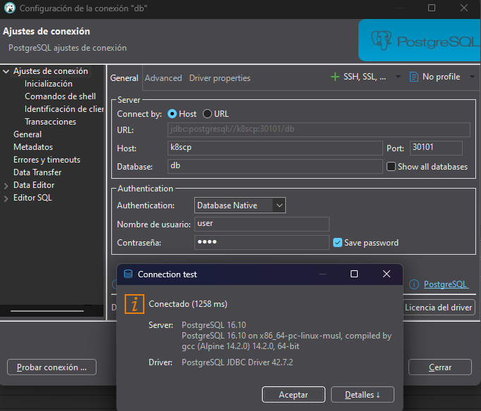
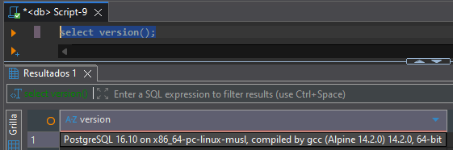
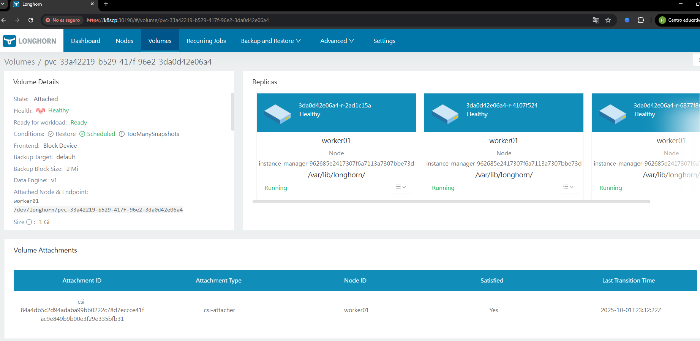

# Despliegue de gestor de base de datos Relacional Postgres

Creamos archivos de definición de objetos de kubernetes para la instalación minima de postgresql utilizando longhorn para el almacenamiento.

* Namespace: Define el tipo de recurso como un Namespace (espacio de nombres), que proporciona un ámbito para los nombres de los recursos dentro del clúster.

```yaml
apiVersion: v1
kind: Namespace
metadata:
  name: ns-postgresql
```

* ConfigMap: Define el recurso como un ConfigMap, utilizado para almacenar datos de configuración no sensibles en pares clave-valor.

```yaml
apiVersion: v1
kind: ConfigMap
metadata:
  name: dev-psql-cm
  namespace: ns-postgresql
data:
  POSTGRES_DB: db
  POSTGRES_USER: user
  # PGDATA en subcarpeta para evitar conflictos con archivos iniciales de la imagen; define donde estará la data en el stateful.
  PGDATA: /var/lib/postgresql/data/pgdata
```

* Secret: Define el recurso como un Secret, utilizado para almacenar datos sensibles como contraseñas

```yaml
apiVersion: v1
kind: Secret
metadata:
  name: dev-psql-secret
  namespace: ns-postgresql
type: Opaque #Tipo genérico de Secret.
stringData:
  POSTGRES_PASSWORD: pass
```

* Service: Define el recurso como un Service, que define una forma de acceder a un conjunto de pods.

```yaml
apiVersion: v1
kind: Service
metadata:
  name: dev-psql-hl-svc  # hl (headless)
  namespace: ns-postgresql
  labels:
    app: psql-hl-svc
spec:
  clusterIP: None # Convierte el Service en un Headless Service. Esto significa que no se le asigna un ClusterIP único y no realiza balanceo de carga. En su lugar, el servidor DNS de Kubernetes devuelve las direcciones IP de los Pods que coinciden con el selector, lo que es vital para que un StatefulSet asigne identidades de red estables a cada Pod (por ejemplo, dev-psql-01-0.dev-psql-01-hl.ns-postgresql.svc.cluster.local).
  selector:
    app: psql
    ver: dev-01
  ports:
    - name: postgres
      port: 5432
      targetPort: 5432
      protocol: TCP
```

* Service: Tipo de Service que expone el Service en un puerto fijo (nodePort) en la IP de cada nodo del clúster. Es la opción más común para un clúster local.

```yaml
apiVersion: v1
kind: Service
metadata:
  name: postgres-service
  namespace: ns-postgresql
  labels:
    app: psql
    ver: dev-01
spec:
  type: NodePort
  selector:
    app: psql
    ver: dev-01
  ports:
    - name: postgres
      port: 5432
      targetPort: 5432
      protocol: TCP
      nodePort: 30101    # Expone este Service en el puerto 30101 de cada nodo del clúster. 
```

* StatefulSet: Define el recurso como un StatefulSet, que es ideal para aplicaciones con estado porque proporciona identidad de red y almacenamiento persistente estable y único para cada réplica. Si un pod cae, al volver tendrá el mismo nombre y volumen asociado.


```yaml
apiVersion: apps/v1
kind: StatefulSet
metadata:
  name: dev-sf-psql
  namespace: ns-postgresql
  labels:
    app: psql
    ver: dev-01
spec:
  serviceName: dev-psql-hl-svc
  replicas: 1
  persistentVolumeClaimRetentionPolicy:
    whenDeleted: Retain
    whenScaled: Retain
  selector:
    matchLabels:
      app: psql
      ver: dev-01
  template:
    metadata:
      labels:
        app: psql
        ver: dev-01
    spec:
      securityContext: # Define la configuración de seguridad del Pod y los contenedores.
        runAsUser: 999       # usuario postgres por defecto
        runAsGroup: 999
        fsGroup: 999
        fsGroupChangePolicy: "OnRootMismatch" # Indica a Kubernetes que solo cambie el dueño/grupo de un volumen si el grupo del sistema de archivos no coincide, acelerando la inicialización en volúmenes grandes.
      containers:
        - name: postgres
          image: postgres:16-alpine
          imagePullPolicy: IfNotPresent
          ports:
            - containerPort: 5432
          envFrom:
            - configMapRef:
                name: dev-psql-cm
            - secretRef:
                name: dev-psql-secret
          volumeMounts:
            - name: pgdatavol
              mountPath: /var/lib/postgresql/data
          # Probes para salud:
          readinessProbe:
            exec:
              command: ["sh", "-c", "pg_isready -U \"$POSTGRES_USER\" -d \"$POSTGRES_DB\" -h 127.0.0.1 -p 5432"]
            initialDelaySeconds: 10
            periodSeconds: 5
            timeoutSeconds: 3
            failureThreshold: 6
          livenessProbe:
            exec:
              command: ["sh", "-c", "pg_isready -U \"$POSTGRES_USER\" -h 127.0.0.1 -p 5432"]
            initialDelaySeconds: 20
            periodSeconds: 10
            timeoutSeconds: 5
            failureThreshold: 6
          resources:
            requests:
              cpu: "100m"
              memory: "256Mi"
            limits:
              cpu: "500m"
              memory: "1Gi"
  # Reclamo de almacenamiento con Longhorn (RWO)
  volumeClaimTemplates: # <prefix-del-template>-<nombre-del-statefulset>-<ordinal> : ordinal hace referencia a la cantidad de replicas.
    - metadata:
        name: pgdatavol  # pgdatavol-dev-psql-01-0
      spec:
        accessModes: ["ReadWriteOnce"]
        storageClassName: longhorn
        resources:
          requests:
            storage: 1Gi
```

Ejecutamos los siguientes comandos:

```bash
kubectl apply -f .\01_ns.yaml
namespace/ns-postgresql created
kubectl apply -f .\02_cm.yaml
configmap/dev-psql-cm created
kubectl apply -f .\03_secret.yaml
secret/dev-psql-secret created
kubectl apply -f .\04_svc.yaml
service/dev-psql-hl-svc created
service/postgres-service created
kubectl apply -f .\05_statefulset.yaml
statefulset.apps/dev-sf-psql created
```

Se definió dos services, uno para que los servicios internos se puedan comunicar con el postgres  y otro para la conexión externa(NodePort). Podemos conectarnos con el dns del cluster por el puerto `30101`.

Utilizamos dbeaver para mostrar la conexión exitosa.



Con el siguiente comando `select version();` podemos ver la versión:



También podemos visualizar en longhorn el volumen con sus replicas.




> Nota: Con esta configuración si se borra el statefulset. El volumen no es afectado. Si vuelvo a desplegarlo, los datos siguen visualizandose.

[⬅️ Anterior](../aprovisionamiento/aprovisionamiento.md) | [🏠 Volver al Inicio](../README.md) | [➡️ Siguiente](../backend/backend.md) 
